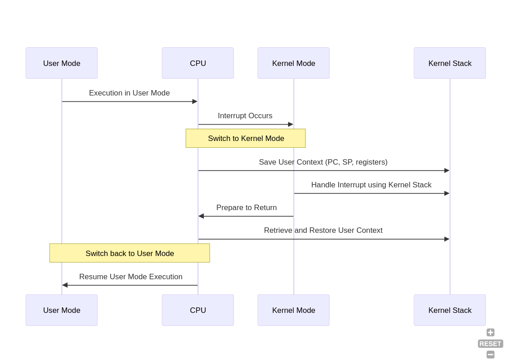

## Kernel Stack Pointer Management During Interrupts

* **Switching to Kernel Mode:** When an interrupt occurs in user mode, the hardware automatically switches to kernel mode.  This involves saving the current CPU state (registers, including the User Stack Pointer) onto the kernel stack. The processor then loads the Kernel Stack Pointer (KSP) from the Task State Segment (TSS) into the stack pointer register (SP).  The TSS holds the KSP for each CPU core, ensuring the correct kernel stack is used.  This mechanism utilizes a single stack pointer register (SP) but switches between different stack segments based on the privilege level (ring 3 for user mode, ring 0 for kernel mode).  The SS:ESP (stack segment and pointer) for kernel mode is stored in the TSS and loaded into SP during the interrupt.

* **Returning from Interrupt:**  The `iret` instruction (or similar) restores the saved state from the kernel stack, including the user mode stack pointer.  This effectively switches back to the user stack by restoring the user's SS:ESP to the SP register.

* **Process Control Block (PCB) Storage:** The PCB (`task_struct` in Linux) isn't saved directly on the stack during an interrupt.  Each process/thread has a pre-allocated kernel stack, pointed to by `task_struct->stack`.  The CPU context (PC, registers, user stack pointer) is saved on this pre-allocated kernel stack upon entering an interrupt. `task_stack_page()` can locate the stack page if the stack isn't managed directly through `task_struct`.

* **Interrupt Handling:** The Interrupt Descriptor Table (IDT) contains pointers to interrupt handlers (kernel code). When an interrupt occurs, the corresponding handler is invoked, and it utilizes the pre-allocated kernel stack for the current process/thread.  This ensures the kernel operates within the correct context.

This system ensures the correct stack pointer is used based on the privilege level, maintaining execution flow and data integrity between user and kernel mode.
