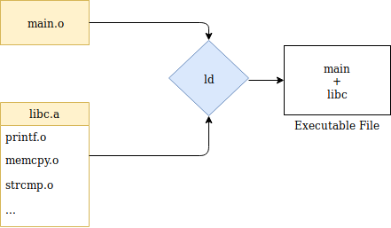
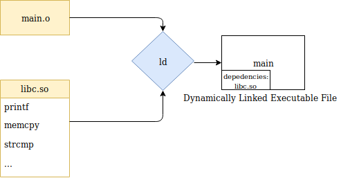

# Linking in ELF (Executable and Linkable Format)

## Static Linking

- **Process Overview:**
  - **Object File (`main.o`):** Contains the compiled code for the main program.
  - **Static Library (`libc.a`):** An archive of object files for standard library functions like `printf`, `memcpy`, `strcmp`, etc.
  - **Linker (`ld`):** Combines all necessary object and library files.
  - **Result:** A single executable file (`main + libc`) that includes all required code.

- **Advantages:**
  - **Portability:** The executable is self-contained and does not rely on external libraries.
  - **Stability:** Changes in external libraries do not affect the executable.

- **Disadvantages:**
  - **Larger File Size:** Each executable includes its own copy of library functions, leading to redundancy.
  - **Inefficiency:** Multiple programs using the same library functions will have multiple copies in memory.

## Dynamic Linking

- **Process Overview:**
  - **Object File (`main.o`):** Contains the compiled code for the main program.
  - **Shared Object Library (`libc.so`):** A shared library containing standard functions, loaded at runtime.
  - **Linker (`ld`):** Creates an executable with placeholders for shared library functions.
  - **Dynamic Linker (`ld-linux.so`):** Resolves library references and loads necessary libraries at runtime.
  - **Result:** A dynamically linked executable that relies on shared libraries.

- **Advantages:**
  - **Memory Efficiency:** Multiple programs share the same library in memory, reducing overall usage.
  - **Easier Updates:** Updating a shared library updates all programs using it simultaneously.

- **Disadvantages:**
  - **Library Dependency:** The executable requires the presence of specific libraries at runtime.
  - **Potential for Incompatibility:** If libraries are missing or incompatible, the program may fail to run.

By understanding both static and dynamic linking, developers can choose the appropriate method based on their specific needs, balancing between portability, efficiency, and maintainability.
